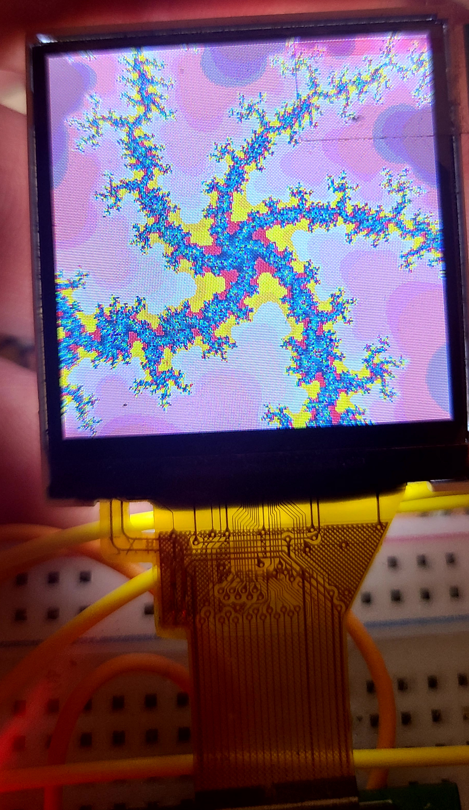
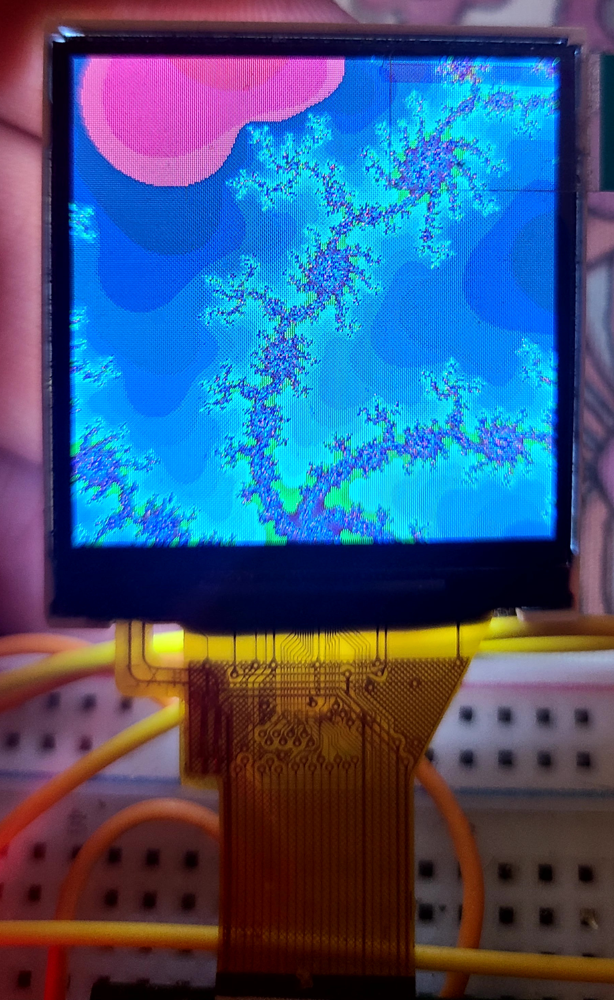
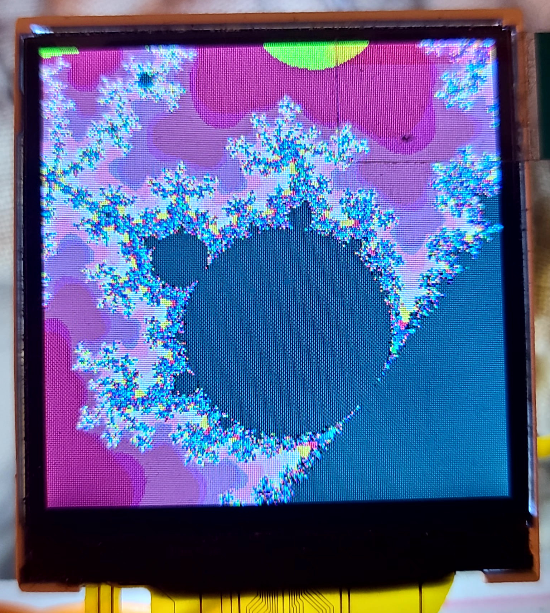
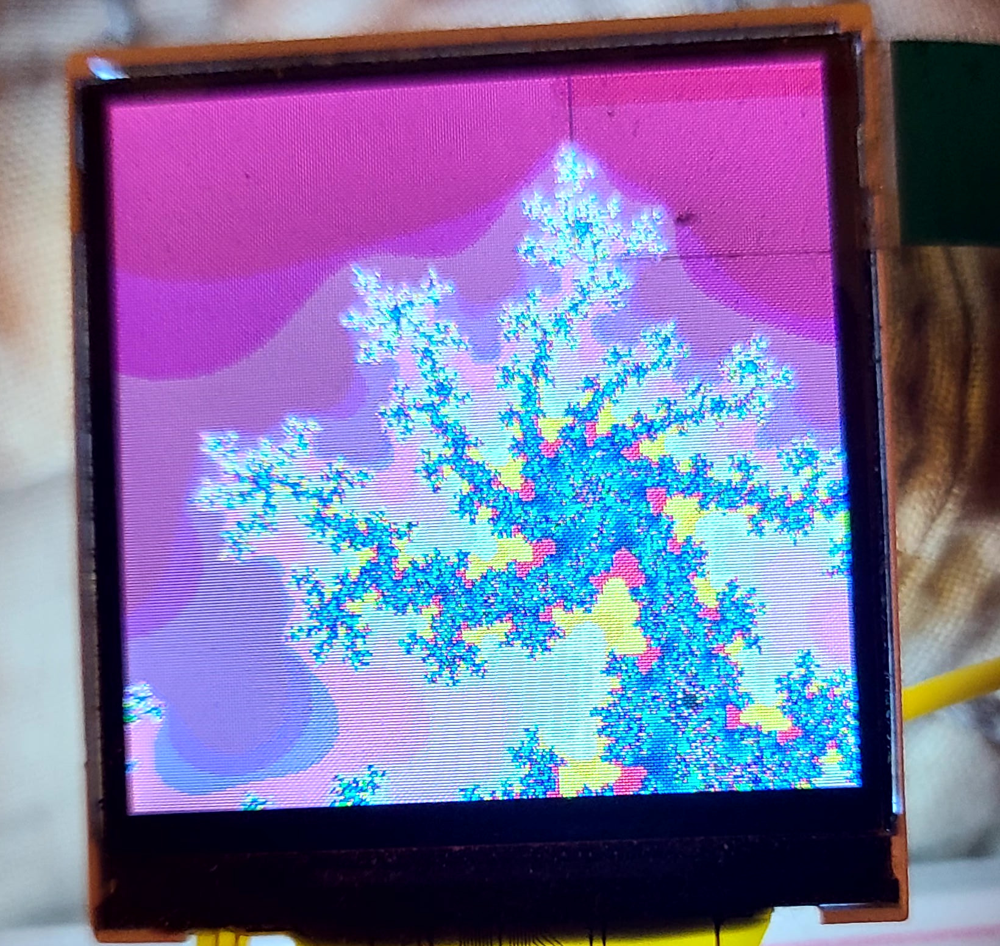

# STM32 Mandelbrot
Mandlebrot set explorer written in bare-metal C for the STM32 NUCLEO-F303K8. The set is drawn to a small TFT display and exploration is controlled by several buttons and a time-of-flight sensor. 

## Display
1.54" 240x240 RGB565 TFT display with a ST7789V driver IC controlled over SPI

Due to limited memory, the display is updated in blocks using a 24x24 pixel buffer. So far, the entire display can be updated in about 37ms (drawing the mandlebrot set takes longer due to the calculations required).

## Buttons
Four buttons are used to move around the set. A fifth button is used to enter zoom mode.

## Time-of-flight Sensor
STM's VL53L4CD time-of-flight sensor controlled over I2C

When in zoom mode, the display prints a value between 0 and 20 depending on the reading from the sensor. When the desired zoom is displayed, the zoom mode button is pressed to confirm. The set is redrawn zoomed by 2^zoom_val.

## Zoom Pictures

